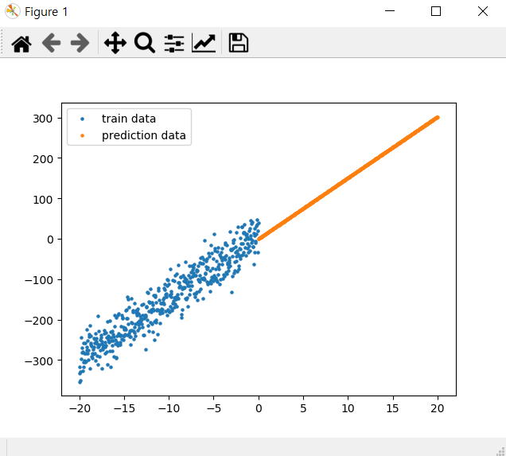

# AI Project (Sub 1)

앞으로 프로젝트를 진행할 실습 환경을 구축하고, 신경망 네트워크의 기초를 학습한다. 
딥 러닝 알고리즘을 이해하는데 기반이 되는 선형 회귀(Linear Regression) 기법에 대해 학습하고, 앞으로 사용할 데이터셋을 살펴본다. 선형 회귀 모델과 추후에 사용할 신경망 네트워크(Neural network)를 구현하기 위해서는 머신 러닝 방법론에 대한 이해, 손시로가 이를 최적화하면서 모델을 학습해가는 과정에 대한 학습을 진행한다.

## Steps
### 개발 환경 구성
1. 아나콘다 설치
	- 웹사이트 접속 후 Window용 Version 3.7 다운로드
	[아나콘다 설치 접속하기](https://www.anaconda.com/distribution)

	- 아나콘다 가상 환경 생성 및 활성화
	```
	C:\Users\multicampus\s02p21a305> conda create -n AI python=3.7
	C:\Users\multicampus\s02p21a305> conda activate AI
	```

	- Tensorflow 및 필요 라이브러리 설치
	```
	(AI) C:\Users\multicampus\s02p21a305> conda install git matplotlib scikit-learn tqdm scipy numpy tensorflow-gpu==2.0.0
	```
	
	- 스켈레톤 프로젝트 다운로드 후, datasets 폴더에서 압축 해제
	
	- 스켈레톤 샘플 실행 확인
	```
	(AI) C:\Users\multicampus\s02p21a305> python linear_regression.py
	```
	
	
2. 스켈레톤 프로젝트 구조

|폴더_파일|설명|
|:---:|:----:|
|checkpoints/|학습된 모델들이 저장되는 폴더|
|data/|데이터 처리 함수들이 위치한 폴더|
|datasets/|실제 데이터가 위치한 경로|
|models|이미지 캡셔닝 모델이 위치한 경로|
|utils/|데이터 시각화, 학습 및 테스트에 필요한 윹리리티 함수들이 위치한 경로|
|config.py|설정 변수들이 저장된 파일|
|linear_regression.py|선형회귀모델의 학습 및 시각화 예시코드가 있는 파일|
|predict.py|학습된 모델을 사용해 새로운 데이터에 대해 결과값을 예측하는 파일|
|train.py|캡셔닝 모델 학습 파일|
- - -

### Req 1. 단순 선형 회귀 모델 구현
[Readme 보러 가기](./works/README_req1.md)

- - -

### Req 2. 이미지 캡셔닝 Configuration
[Readme 보러 가기](./works/README_req2.md)
- - -

### Req 3. 이미지 캡셔닝 데이터 전처리
[Readme 보러 가기](./works/README_req3.md)
- - -

### Req4. 데이터 시각화
[Readme 보러 가기](./works/README_req4.md)
- - -


## 최종 실행 파일(train.py)
```python
#! train.py
import config
from data import preprocess
from utils import utils


# config 저장
utils.save_config()


# (Req. 3-1) 이미지 경로 및 캡션 불러오기
dictionary = preprocess.get_path_caption()


# (Req. 3-2) 전체 데이터셋을 train,test 랜덤으로 분리해 저장하기
train_dataset_path, val_dataset_path = preprocess.dataset_split_save(dictionary)


# (Req. 3-3) 저장된 데이터셋 불러오기
# train_data만 원하는 경우
img_caption = preprocess.get_data_file(train_dataset_path)
# test_data만 원하는 경우
img_caption = preprocess.get_data_file(val_dataset_path)


# (Req. 3-4) 데이터 샘플링
# Req.3-1 결과를 파라미터로 넘긴다
if config.do_sampling:
    img_caption = preprocess.sampling_data(dictionary)


# 이미지와 캡션 시각화 하기
#img: 사진파일명, caption 매칭되는 캡션
utils.visualize_img_caption(img, caption)
```
- - -


## 심화 과제 : Fashion MNIST 분류 모델 구현
[Readme 보러 가기](./works/README_second.md)