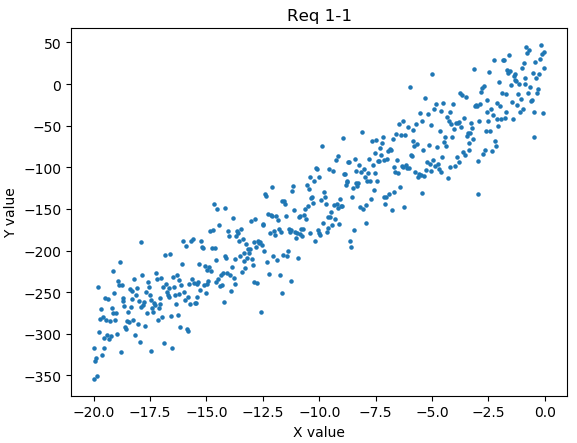
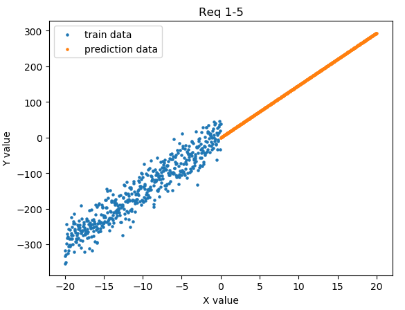

# Req 1. 단순 선형 회귀 모델 구현

### Req. 1-1 : 데이터 읽기 및 시각화
- Numpy, Matplotlib 라이브러리를 사용해 datasets/linear_train.npy 데이터셋을 읽어온다.
- 이 때 x축, y축 데이터 열을 가진 데이터를 구분하고, 데이터를 시각화한다.


```python
import tensorflow as tf
import numpy as np
import matplotlib.pyplot as plt

# 데이터 불러오기
train_data = np.load("..\\datasets\\linear_train.npy")

# tf 형식에 맞게 변환
x_data = np.expand_dims(train_data[:,0], axis=1) #train_data의 x값만 따로 저장
y_data = train_data[:,1] #train_data의 y값만 따로 저장

# 결과 시각화
plt.title('Req 1-1')
plt.xlabel('X value')
plt.ylabel('Y value')
plt.scatter(x_data,y_data,s=5)
plt.show()

#load 종료
train_data.close()
```


- - -

### Req. 1-2 : 선형 모델 클래스 구현
- models/linear_model.py를 참조해 LinearModel()의 클래스를 구현한다.
- 이 때 LinearModel클래스는 tf.keras.Model을 상속하고, call() 호출 시 입력 값에 대한 결과 값을 리턴한다.
```python
import tensorflow as tf

class LinearModel(tf.keras.Model):#tf.keras.Model을 상속
	def __init__(self, num_units):
		super(LinearModel, self).__init__()
		self.units = num_units
		self.model = tf.keras.layers.Dense(units=self.units)

	def call(self,x):
		return self.model(x)
```
- - -

### Req 1-3 : 최적화 함수 및 손실 함수 바인딩
- 모델의 학습에 사용할 최적화 함수 및 손실 함수를 바인딩하여 모델을 컴파일한다.
```python
import tensorflow as tf
import numpy as np
import matplotlib.pyplot as plt

from models.linear_model import LinearModel


# 데이터 불러오기
train_data = np.load(".\\datasets\\linear_train.npy")
# test_x = np.load(".\\datasets\\linear_test_x.npy")


# tf 형식에 맞게 변환
x_data = np.expand_dims(train_data[:,0], axis=1) #train_data의 x값만 따로 저장
y_data = train_data[:,1] #train_data의 y값만 따로 저장


# 모델 생성
model = LinearModel(num_units=1)

# 최적화 함수, 손실함수와 모델 바인딩
model.compile(optimizer=tf.keras.optimizers.SGD(learning_rate=0.001),
			  loss=tf.keras.losses.MSE,
			  metrics=[tf.keras.metrics.MeanSquaredError()])

# SGD(Stochastic Gradient Descent) : 확률적 경사 하강법
#  >> 입력 데이터가 확률적으로 선택된다.
# loss : MSE(Mean Square, Error비용함수)
# MeanSquaredError : 실제결과값과 예상값의 차이(error)

# 모델 정리
model.summary()
#load 종료
train_data.close()
```
- - -

### Req 1-4 : 모델 학습 함수 구현
- 읽어 온 x축과 y축 데이터를 바탕으로 (x축 데이터, y축 데이터, epochs, batch_size)의 매개변수로 모델을 학습하는 함수를 구현한다.
> epochs : 데이터 전체에 대한 학습 반복 횟수
> batch_size : 배치(집단)의 크기
```python
import tensorflow as tf
import numpy as np
import matplotlib.pyplot as plt

from models.linear_model import LinearModel


# 데이터 불러오기
train_data = np.load(".\\datasets\\linear_train.npy")
# test_x = np.load(".\\datasets\\linear_test_x.npy")


# tf 형식에 맞게 변환
x_data = np.expand_dims(train_data[:,0], axis=1) #train_data의 x값만 따로 저장
y_data = train_data[:,1] #train_data의 y값만 따로 저장


# 모델 생성
model = LinearModel(num_units=1)

# 최적화 함수, 손실함수와 모델 바인딩
model.compile(optimizer=tf.keras.optimizers.SGD(learning_rate=0.001),
			  loss=tf.keras.losses.MSE,
			  metrics=[tf.keras.metrics.MeanSquaredError()])

# SGD(Stochastic Gradient Descent) : 확률적 경사 하강법
#  >> 입력 데이터가 확률적으로 선택된다.
# loss : MSE(Mean Square, Error비용함수)
# MeanSquaredError : 실제결과값과 예상값의 차이(error)

# # 모델 학습
model.fit(x=x_data, 
		  y=y_data, 
		  epochs=10, #데이터 전체에 대한 학습 반복 횟수
		  batch_size=32) #배치(batch=집단)의 크기

# 모델 정리
model.summary()
#load 종료
train_data.close()
```


### Req 1-5 : 예측 및 결과 시각화
- 학습된 모델을 이용해, 새로 입력받은 데이터(.datasets/linear_test_x.pny)의 예측 결과 값을 리턴한다.
```python
import tensorflow as tf
import numpy as np
import matplotlib.pyplot as plt
from Req1_2 import LinearModel


# 데이터 불러오기
train_data = np.load("..\\datasets\\linear_train.npy")
test_x = np.load("..\\datasets\\linear_test_x.npy")


# train_data를 tf 형식에 맞게 변환
x_data = np.expand_dims(train_data[:,0], axis=1) #train_data의 x값만 따로 저장
y_data = train_data[:,1] #train_data의 y값만 따로 저장


# 모델 생성
model = LinearModel(num_units=1)

# 최적화 함수, 손실함수와 모델 바인딩
model.compile(optimizer=tf.keras.optimizers.SGD(learning_rate=0.001),
			  loss=tf.keras.losses.MSE,
			  metrics=[tf.keras.metrics.MeanSquaredError()])

# 모델 학습
model.fit(x=x_data, 
		  y=y_data, 
		  epochs=10, 
		  batch_size=32)


# 모델 테스트
prediction = model.predict(x=test_x,
    					   batch_size=None)


# 결과 시각화
plt.title('Req 1-5')
plt.xlabel('X value')
plt.ylabel('Y value')
plt.scatter(x_data,y_data,s=5,label="train data")
plt.scatter(test_x,prediction,s=5,label="prediction data")
plt.legend()
plt.show()


# 모델 정리
model.summary()
#load 종료
train_data.close()
```
