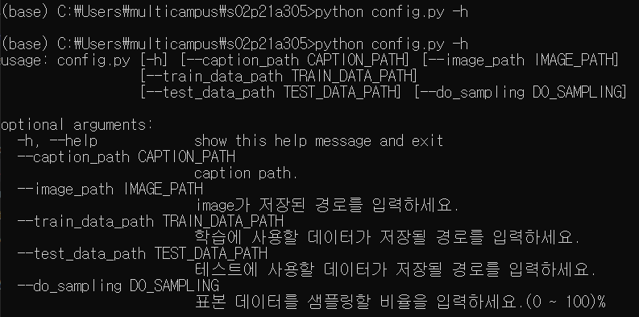

# Req 2. 이미지 캡셔닝 Configuration

### Req. 2-1 : config.py 파일 구현
1. 이미지 캡셔닝 모델 구현에 필요한 세팅 값들을 저장해 놓은 config.py 파일 생성(argparser 모듈 이용)
2. 세팅 값의 예시는 캡션 데이터가 저장된 csv 파일의 경로, 실제 이미지 파일들이 저장된 경로 등이 있다.
3. 전체적인 기능 명세를 살펴 보고, 앞으로 게속 필요한 configuration 세팅 값들을 적절히 추가한다.

```python
import argparse

# Req. 2-1	Config.py 파일 생성

parser = argparse.ArgumentParser()
parser.add_argument('--caption_path', type=str, default='.\\datasets\\captions.csv', help='caption path(default:.\\).')
parser.add_argument('--image_path', type=str, default='.\\datasets\\images\\', help='image가 저장된 경로를 입력하세요.')
parser.add_argument('--train_data_path', type=str, default='.\\datasets\\', help='학습에 사용할 데이터가 저장될 경로를 입력하세요.')
parser.add_argument('--test_data_path', type=str, default='.\\datasets\\', help='테스트에 사용할 데이터가 저장될 경로를 입력하세요.')
parser.add_argument('--do_sampling', type=int, default=0, help='표본 데이터를 샘플링할 비율을 입력하세요.(0 ~ 100)%')
args = parser.parse_args()

do_sampling=args.do_sampling
```
- python.py 실행 시, 각각의 argument와 함께 지정하고 싶은 데이터(파일 경로, 저장 경로, 특정 데이터 Value등)를 입력할 수 있다.



### Req. 2-2 : 세팅 값 저장
1. Configuration 변수들은 추후 다양하게 바꿔가며 실험되기 때문에, train.py를 실행할 때마다 당시의 세팅 값들을 저장하는 함수를 구현한다.
2. 해당 함수는 utils/utils.py에 구현한다.

```python
#! utils/utils.py

# Req. 2-2	세팅 값 저장
import config

def save_config():
	config
```