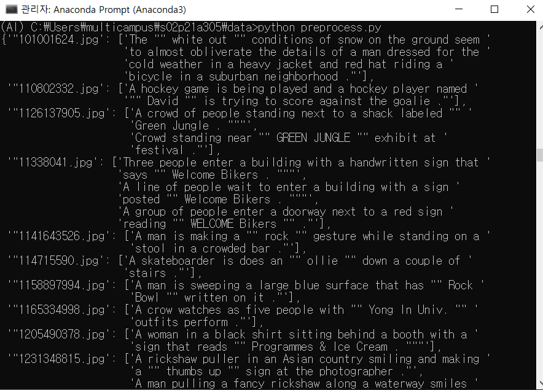
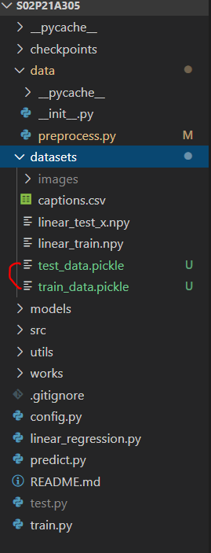

# Req 3. 이미지 캡셔닝 데이터 전처리

### Req. 3-1 : 이미지 경로 및 캡션 불러오기
1. 캡션 파일을 읽어와 이미지 파일 경로와 캡션을 리턴하는 함수를 구현한다.
2. 이미지 파일 이름과 각 파일에 해당하는 캡션이 저장된 csv 파일을 읽어온다.
3. 파일에 있는 이미지 파일 이름과 캡션을 분리해 각각을 리스트로 만들어 리턴한다.
(*하나의 리스트로 만들어 관리해도 무방*)

```python
#! data/preprocess.py
import config

# Req. 3-1	이미지 경로 및 캡션 불러오기
def get_path_caption():
    # config
    caption_path = config.args.caption_path
    file = open(caption_path, 'r')
    
    #첫줄 제외하고 line으로 읽기
    data = file.readlines()[1:]
    file.close()

    dictionary = {}
    for line in data:
        token = line.split()
        img = token[0].split('|')[0]
        caption = ' '.join(token[2: ]).replace(',', '')

        if img not in dictionary:
            dictionary[img] = [caption]
        else:
            dictionary[img].append(caption)
    return dictionary
```



- - -

### Req. 3-2 : 전체 데이터셋을 분리해 저장하기
1. 전체 데이터를 학습용 및 테스트용 데이터로 랜덤하게 분리해 각각을 datasets 폴더에 저장하는 함수를 구현합니다.
> pickle 모듈:
> - 원하는 데이터를 자료형의 변경없이 파일로 저장하여 그대로 로드할 수 있다.
> - binary 형태로 파일을 저장하기 때문에 속도와 용량 측면에서 효과적이다.

```python
#! data/preprocess.py
import sys
import pickle
import config
import random

# Req. 3-2	전체 데이터셋을 분리해 저장하기
def dataset_split_save(dictionary):
    # train data : 70%, test data: 30%
    size = len(dictionary)
    train_size = int(size * 0.7)
    test_size = size - train_size

    # random choice train_data and test_data
    # There are two ways to pick random data with dictionary.
    ##########################################################
    # (python 3.5 ver) dictionary는 순서가 보장되어있지 않는다.
    if sys.version_info < (3, 6):# 버전 (3.6.0)보다 작으면
        train_data = dict(list(dictionary.items())[:train_size])
        test_data = dict(list(dictionary.items())[train_size:])


    ##########################################################
    # (python 3.6 ver) dictionary는 순서가 보장되어
    # list로 변환후 shuffle하여 다시 dictionary로 변환해준다.
   else:
        total_keys = list(dictionary.keys())
        random.shuffle(total_keys)

        data_num = 0
        train_data = {}
        test_data = {}
        for key in total_keys:
            train_data[key] = dictionary[key]

            if data_num == train_size:
                test_data[key] = dictionary[key]
            else:
                data_num += 1
                train_data[key] = dictionary[key]

    ##########################################################
    train_dataset_path=config.args.train_data_path+"train_data.pickle"
    test_dataset_path=config.args.test_data_path+"test_data.pickle"

    # pickle 모듈을 활용해 dictionary 자체를 binary로 저장
    with open(train_dataset_path, "wb") as fw:
        pickle.dump(train_data, fw)

    with open(test_dataset_path, "wb") as fw:
        pickle.dump(test_data, fw)

    return train_dataset_path, test_dataset_path
```


 pickle 확장자로 저장된 train/test 데이터


- - -

### Req. 3-3 : 저장된 데이터셋 불러오기
1. 분리하여 저장한 데이터를 읽어와 이미지 경로와 이에 해당하는 캡션의 목록을 리턴하는 함수를 구현한다.
2. 이때 함수의 인자에 따라 학습용 데이터 또는 테스트 데이터를 불러올 수 있도록 한다.

```python
#! data/preprocess.py
import pickle
# Req. 3-3	저장된 데이터셋 불러오기
def get_data_file(data_path):

    # pickle 모듈을 활용해 dictionary 호출
    with open(data_path, "rb") as fr:
        return pickle.load(fr)
```

### Req. 3-4 : 데이터 샘플링
1. 이미지 경로와 캡션 데이터를 입력으로 받아, 지정한 개수 또는 비율만큼의 데이터를 샘플링 할 수 있는 함수를 구현한다.
2. 샘플링은 선택적으로 사용할 수 있도록 한다.

```python
#! config.py
import argparse

parser = argparse.ArgumentParser()
parser.add_argument('--caption_path', type=str, default='.\\datasets\\captions.csv', help='caption path.')
parser.add_argument('--image_path', type=str, default='.\\datasets\\images\\', help='image가 저장된 경로를 입력하세요.')
parser.add_argument('--train_data_path', type=str, default='.\\datasets\\', help='학습에 사용할 데이터가 저장될 경로를 입력하세요.')
parser.add_argument('--test_data_path', type=str, default='.\\datasets\\', help='테스트에 사용할 데이터가 저장될 경로를 입력하세요.')
####### 추가
parser.add_argument('--do_sampling', type=int, default=0, help='표본 데이터를 샘플링할 비율을 입력하세요.(0 ~ 100)%%')
args = parser.parse_args()

###### 추가
do_sampling=args.do_sampling
```

```python
#! data/preprocess.py
import sys
import random

# Req. 3-4	데이터 샘플링
# 전체 데이터에서 do_sampling 비율만큼만 랜덤 샘플링하여 return
def sampling_data(dictionary):

    sample_num = int(config.args.do_sampling * 0.01)

    #########################################################
    # (python 3.5 ver)
    if sys.version_info < (3, 6):# 버전 (3.6.0)보다 작으면
        return dict(list(dictionary.items())[:sample_num])

    #########################################################
    # (python 3.6 ver)
    else:
        keys = list(dictionary.keys())
        random.shuffle(keys)

        data_num = 0
        sample_data = {}

        for key in keys:
            sample_data[key] = dictionary[key]
            data_num += 1
            if data_num == sample_num:
                braek
    
        return sample_data
```