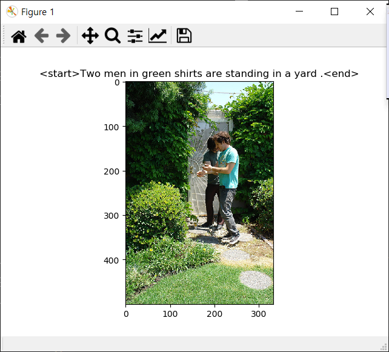

# Req4. 데이터 시각화

**jpg를 로드할 수 있도록 pillow 패키지를 설치한다.**
```
(AI) C:\Users\multicampus\s02p21a305> pip install pillow
```

1. 이미지 파일과 캡션을 입력으로 받아, 이를 시각화하는 함수를 구현한다.
```python
#! utils/utils.py
import config
import matplotlib.pyplot as plt
import matplotlib.image as mpimg
# Req. 4-1	이미지와 캡션 시각화
def visualize_img_caption(image, caption):
	
	plt.title('<start> '+caption+' <end>')
	img = mpimg.imread(config.args.image_path+image)
	plt.imshow(img)
	plt.show()
```

