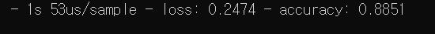

#  심화 학습: Req 5. Fashion MNIST 분류 모델 구현
[참고사이트](https://www.tensorflow.org/tutorials/keras/classification)

### Req. 5-1 : Fashion MNIST 데이터 다운 및 시각화
1. Tensorflow API를 이용해 Fashion MNIST 데이터 다운로드한다.
2. Matplotlib를 통해 다운받은 데이터를 시각화하고 형태를 확인한다. 또한 데이터에서 라벨 혹은 정답 카테고리가 몇 가지 분류로 나눠지는지, 각 라벨이 지칭하는 물체가 무엇인지 파악한다.

```python
#! second_project/train.py

import tensorflow as tf
import numpy as np
import matplotlib.pyplot as plt

(train_images, train_labels), (test_images, test_labels) = tf.keras.datasets.fashion_mnist.load_data()
```
> train_images (60000, 28, 28) : (28x28) 크기의 60000개 이미지 데이터
> train_labels (60000, ) : 이미지가 나타내는 품목을 의미하는 60000개의 라벨(스칼라)
> test_images (10000, 28, 28) : (28x28) 크기의 10000개 이미지 데이터
> test_labels (10000,) : 이미지가 나타내는 품목을 의미하는 10000개의 라벨

- 임의의 train_image를 출력해본다.
```python
np.set_printoptions(linewidth=150)
print(train_images[0])
```


- 각 픽셀당 (0~255) value로 한 눈에 봐도 신발의 모양임을 볼 수 있다. 이 image 데이터를 시각화하여 비교한다.
```python
plt.figure()
plt.imshow(train_images[0], cmap='gray')
plt.grid(False)
plt.show()
```


- 참고사이트로부터 참조하여 10개의 카테고리에 대한 네이밍배열을 생성한다.
```python
class_names = ['T-shirt/top', 'Trouser/pants', 'Pullover shirt', 'Dress', 'Coat',
                'Sandal', 'Shirt', 'Sneaker', 'Bag', 'Ankle boot']
```

---

### Req. 5-2 : 인공신경망 구현 및 컴파일
1. 확인한 형태를 입력으로 받고 카테고리 개수만큼의 값들을 리턴하는 인공신경망을 구현한다. 이 때, 텐서플로우 keras API를 사용한다.
2. 텐서플로우 keras API를 이용해 최적화 함수 및 손실함수를 설정해 모델을 compile한다.
3. 입력 데이터의 형태가 [28, 28]이고 카테고리 개수가 5개라면 인공신경망의 입력과 출력의 형태는 [28, 28] -> [?, ?] -> ... -> [5] 와 같이 변화된다.


- 이미지의 픽셀 값이 0 ~ 1이 되도록 조정한다.
```python
train_images = train_images/255.0
test_images = test_images/255.0
# 소수 둘째자리까지로 출력
print(np.round(train_images[0], 2))
```


float으로 설정된 데이터


- 신경망 모델의 기본 구성은 **input layer / hidden layer / output layer** 로 구성된다.
- tensorflow keras API를 이용해 신경망 모델을 생성한다.
```python
model = tf.keras.Sequential([
	tf.keras.layers.Flatten(input_shape=(28, 28)),
	tf.keras.layers.Dense(128, activation='relu'),
	tf.keras.layers.Dense(10, activation='softmax')
])
```
> 1. **tf.keras.layers.Flatten(input_shape=(28, 28))**
> 	- 입력 레이어 (28, 28)을 일련의 784개 노드로 만들어 준다.
> 	- 외부 입력을 신경망으로 가져오는 역할만 수행한다.
> 2. **tf.keras.layers.Dense(128, activation='relu')**
> 	- hidden layer로 노드 개수가 128개인 Dense 레이어를 사용한다.
> 	- Dense layer : 바로 전 레이어(=input layer)의 각각의 노두가 현재 레이어(=hidden layer)의 모든 노드와 연결된다.
> 	- 노드의 출력을 결정짓는 활성화 함수는 'relu'를 사용한다.[참고사이트 - Sigmoid vs Relu](https://medium.com/@kmkgabia/ml-sigmoid-%EB%8C%80%EC%8B%A0-relu-%EC%83%81%ED%99%A9%EC%97%90-%EB%A7%9E%EB%8A%94-%ED%99%9C%EC%84%B1%ED%99%94-%ED%95%A8%EC%88%98-%EC%82%AC%EC%9A%A9%ED%95%98%EA%B8%B0-c65f620ad6fd)
> 3. **tf.keras.layers.Dense(10, activation='softmax')**
> 	- 출력 레이어는 신경망의 출력을 외부로 전달하는 역할을 수행한다.
> 	- 출력 레이어로 노드 개수가 10개인 Dense layer로 설정한다.
> 	- 활성화 함수로 사용되는 softmax를 거치면 10개(label category가 10개이므로)의 노드 출력의 합이 1이 되도록 조정한다.
> 	- 10개의 출력 합 중, 신경망이 예측한 결과로 가장 큰 값을 선택한다.


- 학습을 시작(model.compile)하기 전에 손실함수, 옵티마이저, 평가지표를 설정해야 한다.
```python
model.compile(
	optimizer='adam'
	loss = 'sparse_categorical_crossentropy',
	metrics=['accuracy']
)
```

> 1. **optimizer='adam'**
> 	- optimizer는 학습 데이터 셋과 손실함수를 사용해 모델의 가중치를 업데이트하는 방법을 결정한다.
> 2. **loss = 'sparse_categorical_crossentropy'**
> 	- 학습을 하는 동안 손실함수를 최소화하도록 모델의 가중치를 조절한다.
> 3. **metrics=['accuracy']**
> 	- 평가 지표(metrics)는 학습과 평가 시 모델 성능을 측정하기 위해 사용된다.
> 	- 여기서는 전체 데이터셋에서 올바르게 분류된 이미지 비율을 표시하는 정확도를 사용한다.
- - -


### Req. 5-3 : 모델 학습 및 테스트
- 모델을 학습한다.
- 학습은 입력 이미지에 대해 잘못된 판정을 내리는 신경망의 오류가 줄어들도록 신경망의 가중치를 조정하여 이루어진다.
- 그 결과로 이미지와 라벨간의 관계를 신경망이 학습한다.
```python
model.fit(train_images, train_labels, epochs=10)
```
> epochs : 학습 반복 횟수


- 학습되는 동안 손실(loss)은 줄어들며, 예측 정확도(accuracy)는 상승한다.
- 손실은 위에서 지정한 손실 함수에 의해 계산된다.


- train_images를 입력으로 학습 시. 틀린 예측을 한 건수를 기반으로 예측 정확도를 계산한다.
```python
test_loss, test_acc = model.evaluate(test_images,  test_labels, verbose=2)
```


> - 학습 시 사용한 훈련 데이터셋(0.91)보다 테스트 데이터셋(0.88)에서 정확도가 떨어졌다.
> - 훈련 데이터셋보다 테스트 데이터셋에서 결과가 안좋은 경우, 모델이 오버피팅 되었다고 한다.
> - 정규화(regulation) 또는 dropout을 추가해 이 문제를 해결할 수 있다.

- - -

### Req. 5-4 : 테스트 결과 시각화
1. 테스트 데이터 셋에서 임의로 10개의 데이터를 뽑아 학습된 모델에 넣어 결과값을 뽑아낸다.
2. 뽑힌 데이터를 시각화하고 모델에서 나온 결과값 및 정답 라벨을 번호가 아닌 카테고리 이름으로 변환하여 동시에 보여준다.

- 임의의 1개 test datum 적용하기
```python
img = test_images[2]
label = test_labels[2]
# img.shape = (28, 28)
# 신경망 입력에 맞는 사이즈인 (1, 28, 28)로 확장
img = np.expand_dims(img, 0)

# 테스트 이미지 삽입
# 신경망은 활성화 함수로 softmax를 사용한다.
# 제일 큰 값이 가장 적합한 노드로 에측된 결과이다.
predictions = model.predict(img)
print('<Prediction Result>')
print(predictions)
print('<Fittest Output Node>')
print(np.argmax(predictions))
print('<Origin Label> | <Predictions Reulst>')
print(class_names[label] + ' | '+ class_names[np.argmax(predictions)])
```


- 임의의 10개 test data 적용하기
```python
import random

plt.figure(figsize=(4, 7))
i = 1
cnt = 10

while i <= cnt:
    idx = random.randint(0, len(test_images))

    # 이 때의 img.shape = (28, 28)
    img = test_images[idx]
    label = test_labels[idx]
    # 신경망 입력에 맞는 사이즈인 (1, 28, 28)로 확장
    img = np.expand_dims(img, 0)

    # 테스트 이미지 삽입
    # 신경망은 활성화 함수로 softmax를 사용한다.
    # 제일 큰 값이 가장 적합한 노드로 에측된 결과이다.
    predictions = model.predict(img)
    result = np.argmax(predictions)
    
    # Prediction 시각화
    plt.subplot(2, 5, i)
    plt.xticks([])
    plt.yticks([])
    plt.grid(False)
    plt.imshow(test_images[idx], cmap='gray')
    plt.xlabel('Label: '+class_names[label]+'\n'+"Prediction: "+class_names[result])
    i += 1
plt.show()

```

